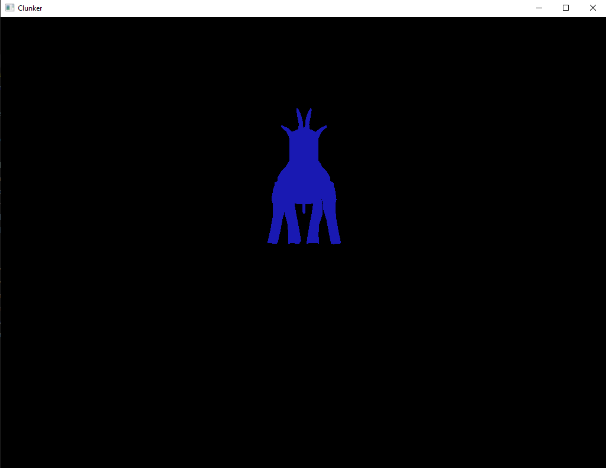

Clunker
=======

This is my first ever experiment with the Rust language. It is basically a program, 
written in Rust, which draws a box using the Vulkan API. 

I am not using ash or any other Vulkan-wrapping crate. I am just accessing
my own [vulkan_helper](https://github.com/dimi309/vulkan_helper) C library with Rust
(vulkan_helper is also used by the [small3d](https://github.com/dimi309/small3d) game development
library). The vulkan_helper and the Vulkan API bindings are created during the build with bindgen.

The code is clumsy and unsafe (I am new in crab-land) but it works.

Prerequisites
-------------

- Rust
- A C compiler (Visual Studio on Windows, gcc / clang on others)
- The [Vulkan SDK](https://vulkan.lunarg.com/) and the`VULKAN_SDK` environment variable set to the path of the SDK

On Linux, even if you are using gcc, clang also needs to be installed. 
On Ubuntu / Debian for example that is done like this:

	sudo apt-get install libclang-dev
   
Setup
-----

You need to execute `prepare-vulkan-helper.bat`on Windows or `prepare-vulkan-helper.sh` 
on Linux and MacOS to build and set up the vulkan_helper library before launching cargo. 

Before doing that you might also need to pull vulkan_helper with git from the `vulkan_helper` 
directory, as it has been added as a git submodule. On MacOS, just pulling from within 
the `vulkan_helper` directory might not work, in which case the submodule can be retrieved
using the following commands:
	
	git submodule init
	git submodule update

The program runs successfully on Windows and MacOS. 

On Linux, the WINIT_UNIX_BACKEND environment variable has to be set to "x11". Otherwise
winit may launch using wayland, making winit's xlib_window() and xcb_connection() window
functions return None. The values returned by these functions are needed for creating a 
Vulkan surface.

