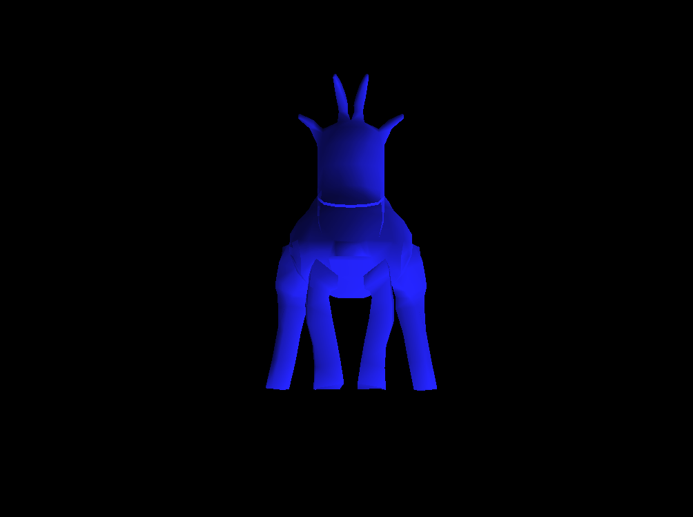

Clunker
=======

This is my first ever experiment with the Rust language. It is basically a program, 
written in Rust, which draws a box using the Vulkan API. 

I am not using ash or any other Vulkan-wrapping crate. I am just accessing
my own [vulkan_helper](https://github.com/dimi309/vulkan_helper) C library with Rust
(vulkan_helper is also used by the [small3d](https://github.com/dimi309/small3d) game development
library).
The vulkan_helper and the Vulkan API bindings are created during the build with bindgen.

The code is clumsy and unsafe (I am new in crab-land) but it works. You need to
execute `prepare-vulkan-helper.bat`on Windows or `prepare-vulkan-helper.sh` 
on Linux and MacOS to build and set up the vulkan_helper library before launching cargo. 
Before that you might also need to pull it with git from the `vulkan_helper` directory,
as it has been added as a git submodule. Unfortunately, I have only managed to run the
program successfully on Windows, as I am having some [issues](https://github.com/dimi309/clunker/issues) with the winit crate on
MacOS and Linux.

Prerequisites
-------------

Rust, Visual Studio, Vulkan SDK (with the`VULKAN_SDK` environment 
variable set to the path of the SDK)

On Linux, clang needs to be installed, on Ubuntu / Debian for example
it is done like this:

   sudo apt-get install libclang-dev

